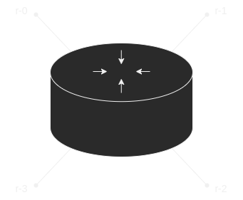

# Software Router

A simple implementation in software for the *data-plane* of a router compatible
with Linux-based operating systems.

The router has 4 interfaces (similar to well-known home "wireless routers") named
**r-0** through **r-3** implemented using UNIX packet sockets (OSI Layer 2).



The forwarding process also handles the ARP and ICMP protocols. A
routing table is required when starting the program - its path should be given
as the single accepted, mandatory command-line argument.
The routing table should have a structure according to the example below (note
that the header should NOT be written in the actual file):

```
(Prefix) (Next hop) (Mask) (Interface)
192.1.8.0 192.1.8.2 255.255.255.0 1
192.1.9.0 192.1.9.2 255.255.255.0 2
192.1.10.0 192.1.10.2 255.255.255.0 0
192.1.11.0 192.1.11.2 255.255.255.0 0
```

The provided Makefile can be used to build the executable called *router* using
the `make build` command. 
